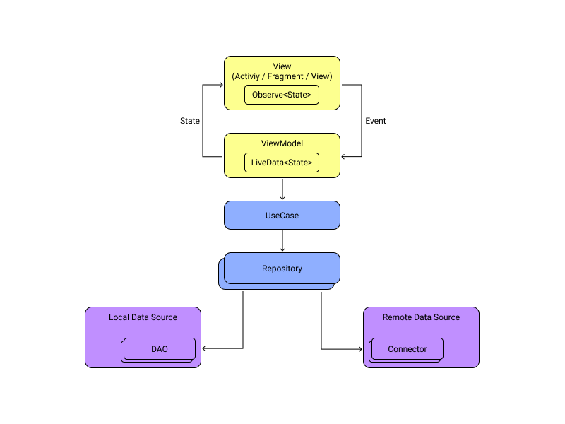

# Meli test project

Android app developed using the [public API](https://api.mercadolibre.com/) of Mercado Libre (Meli) to search products and get some extra details.


## Architecture

MVVM (Model View ViewModel) in the presentation layer + Clean Architecture.




## Tests

Running unit tests:
```
./gradlew test
``` 

Running instrumented tests:
```
./gradlew connectedAndroidTest
```
 

## Linter
Code style is not strongly defined, but for this test project the defaults are enough.
```
./gradlew lint
```